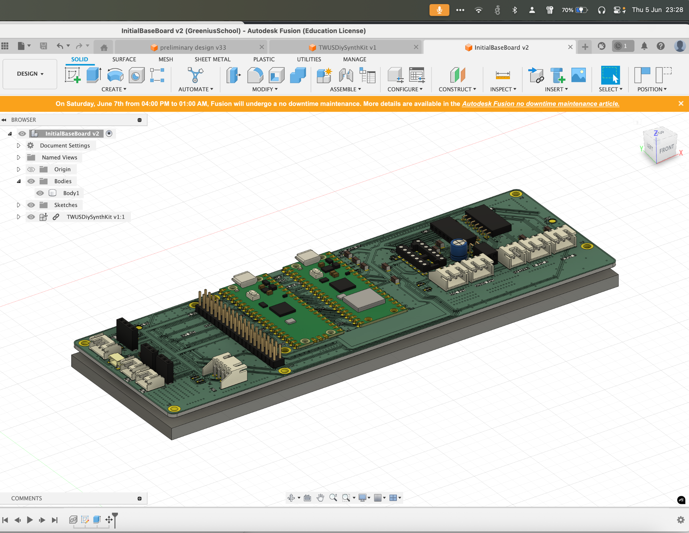

# Journal
 - Oldest at top, newest at bottom of text file.

## Thu 5 Jun 2025
I'd love to say I knew how long I spent on the project so far.
The answer is I don't know.
Probably at least 6 hours, beginning on 31st of May 2025.
I took some inspiration from [baklokb/pcb-pico-pi-base](https://github.com/bablokb/pcb-pico-pi-base)
This allowed me to connect the Pico with standard Pi hats.

_By now the PCB was pretty much complete_

## Fri 6 Jun 2025
Spent a few hours working on CAD for the casing:

_Started with a base plate_

_Then added standoff pillars and room for heatset inserts as appropriate to support the PCB and allow clearance for the throughhole components._

_Then I added a way to secure the lid to the casing. I tapered to allow the heatset inserts to be inserted with relative ease, and added counterbores in the external walls for the screw to sit flush._

_Then I added a way to plug in the Micro USB port to the casing of the Raspberry Pi.
_

_Then I added a way to screw in my potentiometers since they have an M10 threading._

At least another 3 hours.

_Added Speaker Aperture with bevelled edge so it is hypothetically flush_
Another 15 mins.
